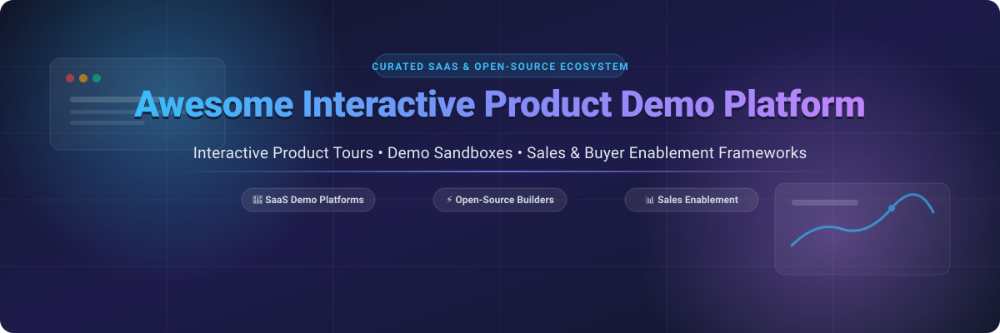

# 🚀 Awesome Interactive Product Demo Platform

  
  
  
  
  
  

> **Curated List of SaaS Demo Automation Platforms & Open-Source Guided Walkthrough Frameworks**  
> *Focused on Interactive Product Tours, Demo Sandboxes, Presales Automation, Guided UI Tours & Buyer Enablement.*

---

## 📌 Table of Contents
- [📊 Market Overview](#-market-overview)
- [💼 SaaS & Hosted Demo Platforms](#-saas--hosted-demo-platforms)
- [⚡ Open-Source GitHub Projects](#-open-source-github-projects)
- [🤝 How to Contribute](#-how-to-contribute)
- [⚠️ Disclaimer](#%EF%B8%8F-disclaimer)
- [📈 Star History](#-star-history)
- [💖 Support & Community](#-support--community)

---

## 📊 Market Overview

📊 **Market Size & Structure**: The Interactive Product Demo & Demo Automation sector is estimated at **~$500M** (growing at **~25% CAGR** toward **$1.5B+** by 2030) as part of the broader **$10B+** Sales & Marketing Enablement ecosystem. The market is **moderately fragmented**, transitioning from early PLG tour creation tools to enterprise presales sandbox consolidation alongside lightweight click-tour tools.

---

## 💼 SaaS & Hosted Demo Platforms

These commercial SaaS platforms enable sales engineers, product marketers, and growth teams to build high-converting clickable product tours, personalized demo environments, and self-serve buyer experiences.

| 🏢 Product | 📝 Description | 💵 Pricing (Starting Tier) | 🎁 Free Tier / Trial Limits | 📈 Company Scale (Valuation / Raised) |
| :--- | :--- | :--- | :--- | :--- |
| **[Reprise](https://www.reprise.com/)** | Enterprise demo and sandbox platform for creating realistic, isolated product environments for sales and presales cycles. | ~$30,000 / year | No free trial (Sales-led demo on request) | ~$400M Valuation ($118M Raised) |
| **[Consensus](https://goconsensus.com/)** | Demo automation platform focused on personalized video and interactive demos that scale sales engineering capacity. | $600 / month ($7,200/yr) | No public free trial (Guided sandbox on request) | ~$350M Valuation ($110M Raised) |
| **[Walnut](https://www.walnut.io/)** | No-code interactive demo platform popular with enterprise product marketing for personalized, shareable product experiences. | $9,200 / year ($766/mo) | No free plan or self-serve trial (Demo on request) | ~$150M Valuation ($56M Raised) |
| **[Demostack](https://www.demostack.com/)** | Demo environment platform that helps enterprise teams spin up and customize realistic product backend environments for sales. | ~$30,000 / year | No free trial (Sales-led scheduled demo) | ~$120M Valuation ($51.5M Raised) |
| **[Navattic](https://www.navattic.com/)** | Market-leading interactive product demo platform for HTML-based click-through tours used by product marketing and sales. | $500 / month (billed annually) | Free Starter Plan: 1 published tour, 100 captured leads limit | ~$50M Valuation ($5M+ ARR) |
| **[Saleo](https://www.saleo.io/)** | Demo personalization platform that overlays custom data and messaging onto live product demos for sales engineering. | ~$20,000 / year | No free trial (Sales-assisted live onboarding) | ~$40M Valuation ($13M Raised) |
| **[TestBox](https://www.testbox.com/)** | Demo and sandbox platform focused on providing isolated product environments with live data for buyer evaluations. | $44,750 / year | No free trial (Sales-led enterprise setup) | ~$35M Valuation ($13.5M Raised) |
| **[Arcade](https://www.arcade.software/)** | Interactive demo and walkthrough tool based on screen recording, popular for quick product tours and marketing content. | $32 / user / month (billed annually) | Free Forever Plan: Up to 3 published Arcades (watermarked) | ~$30M Valuation ($12M Raised) |
| **[Storylane](https://www.storylane.io/)** | Interactive demo and demo-center platform with freemium entry, AI-assisted features, and tools for marketing and sales. | $40 / user / month (Solo tier) | Free Forever Plan: 1 published demo & 1 seat + 14-day free trial on paid | ~$25M Valuation ($3.5M+ ARR) |
| **[ScreenSpace](https://www.screenspace.io/)** | Interactive product demo and storytelling platform aimed at engaging website visitors with guided product experiences. | $29 / month (Starter tier) | 7-day Free Trial with full access (up to 3 active tours) | <$5M Valuation (Seed) |

---

## ⚡ Open-Source GitHub Projects

Full-featured no-code interactive demo platforms are largely commercial, but the developer ecosystem offers robust open-source building blocks—ranging from framework-agnostic step-by-step tour libraries to browser automation, component environments, and open demo builders.

| 📦 Repository | 🏷️ Category | 📝 Description | 🌟 Popularity |
| :--- | :--- | :--- | :--- |
| **[Playwright](https://github.com/microsoft/playwright)** | Browser Automation | Node.js library to script, capture, and record interactive browser product flows for demo automation. |  |
| **[Storybook](https://github.com/storybookjs/storybook)** | UI Component Workshop | Frontend workshop for building UI components in isolation, adapted to showcase interactive product demos. |  |
| **[Docusaurus](https://github.com/facebook/docusaurus)** | Static Site Generator | Open-source static site framework for documentation, product guides, and hosting interactive demo walkthrough pages. |  |
| **[Cypress](https://github.com/cypress-io/cypress)** | End-to-End Testing | Fast, reliable testing framework that automates app flows for UI recording and automated product tour captures. |  |
| **[Driver.js](https://github.com/kamranahmedse/driver.js)** | Guided Tour Library | Lightweight, framework-agnostic JavaScript library for driving user focus with interactive popovers and step tours. |  |
| **[Intro.js](https://github.com/usablica/intro.js)** | Guided Tour Framework | Mature open-source library for creating step-by-step product walkthroughs and feature introductions with progress indicators. |  |
| **[Shepherd.js](https://github.com/shipshapecode/shepherd)** | Guided Tour Engine | Robust JavaScript tour library built with Floating UI for precise element positioning and customizable guided tours. |  |
| **[React Joyride](https://github.com/gilbarbara/react-joyride)** | React Tour Component | Declarative React tour component system for guiding users through web applications with stateful step flows. |  |
| **[Hopscotch](https://github.com/LinkedInAttic/hopscotch)** | Tour Framework | Framework for adding interactive product tours to web pages, originally built by LinkedIn. |  |
| **[Reactour](https://github.com/elrumordelaluz/reactour)** | React Tour UI | Flexible, customizable tour component for React apps with smooth element highlighting and customizable steps. |  |
| **[Propels](https://github.com/Propels-AI/Propels)** | Open Demo Builder | Open-source interactive product demo builder for recording web app flows and embedding clickable tours on landing pages. |  |

---

## 🤝 How to Contribute

1. 🍴 **Fork** the repository.
2. 📝 Add or edit entries in [`README.md`](README.md) following the existing table format.
3. ℹ️ Include: Name, website/repository link, description, pricing details, and Stars_Count badges (for open source).
4. 🚀 Submit a **Pull Request** with a clear explanation of your addition.

---

## ⚠️ Disclaimer

- This is a **community-curated list** for informational purposes—not exhaustive and not an endorsement.
- Demo environments may expose sample product features. Ensure no sensitive or real customer data is included in public product tours.

---

## 📈 Star History

---

## 💖 Support & Community

Thank you for exploring **Awesome-Interactive-Product-Demo-Platform**! 🚀

If you find this curated list helpful for your product marketing, presales, or demo engineering work:
- ⭐ **Star** this repository to show support!
- 🍴 **Fork** it to contribute new SaaS platforms or open-source tools!
- 📢 **Share** it with fellow product marketers, sales engineers, and developers!

 

